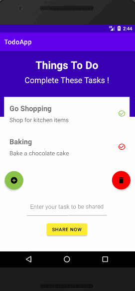
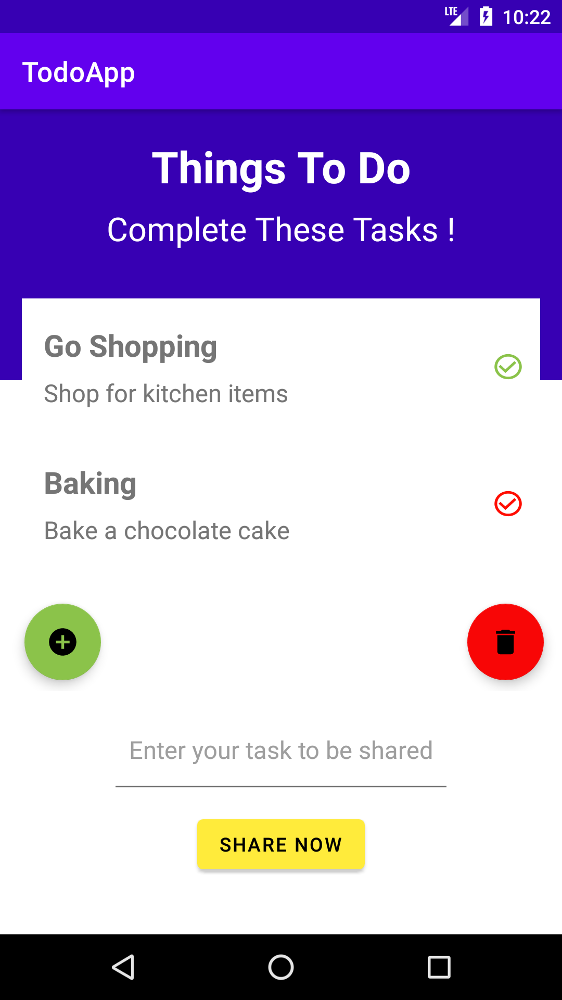
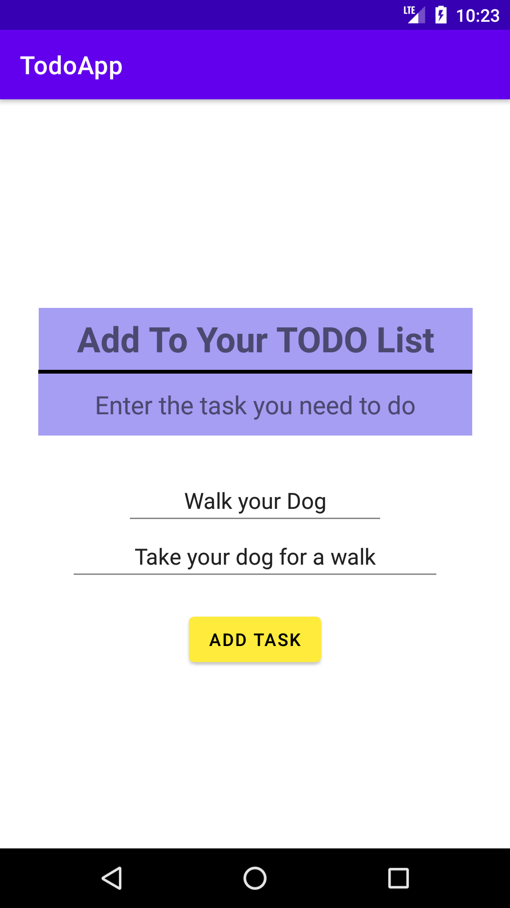
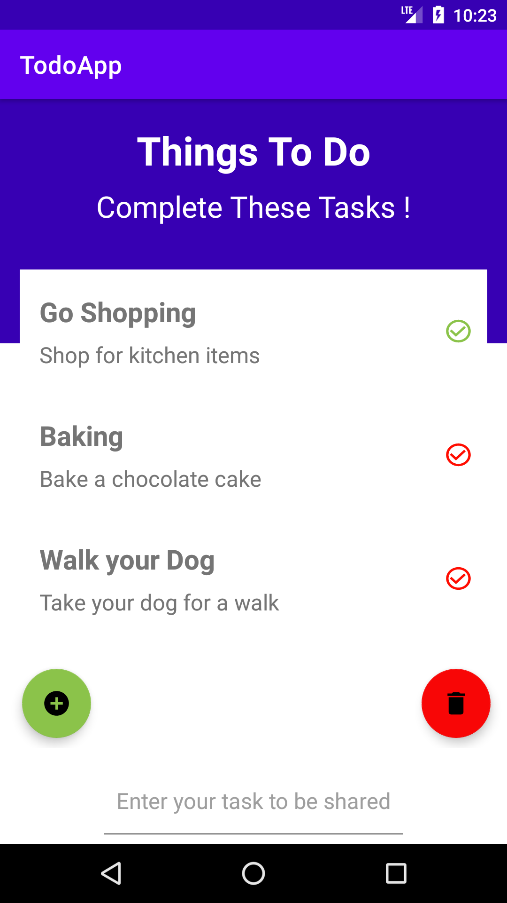
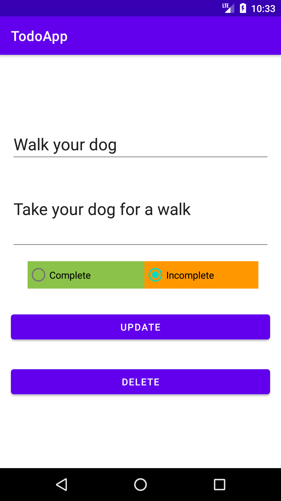
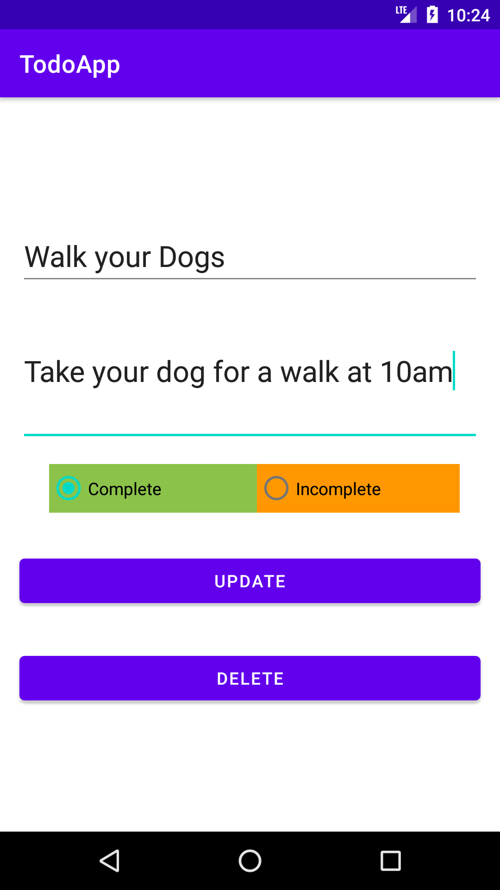
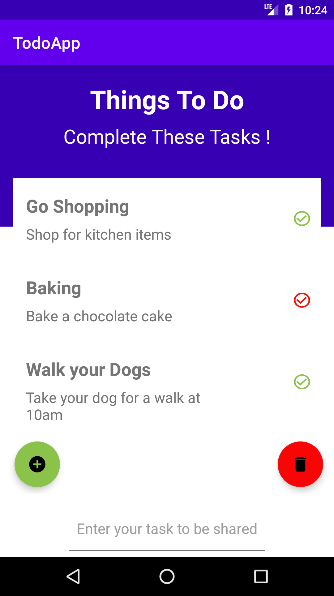
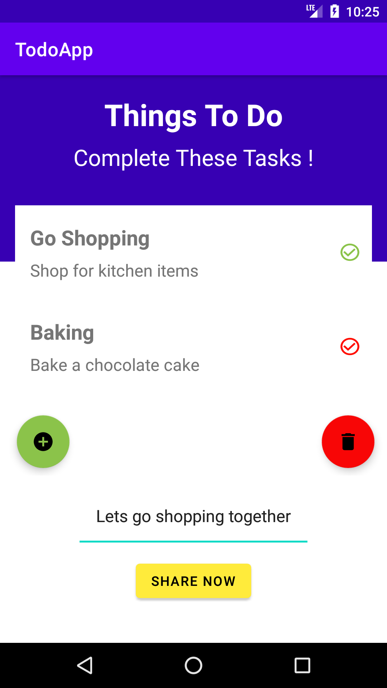
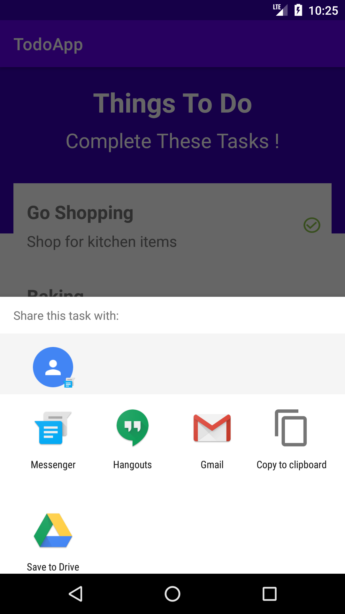
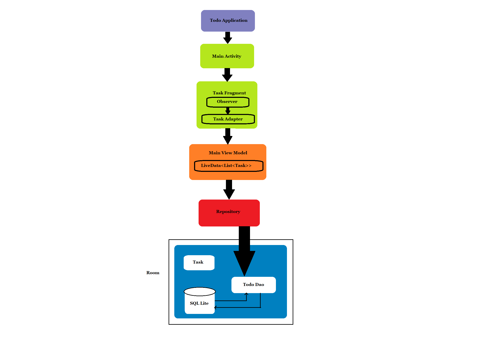

<h1> Developing Mobile Application</h1>
<h3>Todo Application </h3>  

<h5>Features</h5>
<ul>
    <li>Add new tasks</li>
    <li>Update a task</li>
    <li>Delete a task or all the tasks at once</li>
    <li>Share your message about the task with social network or other apps</li>
</ul>

<ul><h5> User Guide </h5>
    <li> Short demonstration of Todo Application   
    
    </li>
    <li>
    User First View:  
    This is the view that the user sees once the user clicks the TodoApp. The user will see the task with their descriptions displayed. Besides each task there is a tick icon. The tick icon appers green if the task is completed and red if it is not completed. Below the list of tasks also exists the add and delete button. With the help of add button the user will be able to add a new task and with the help of delete button the user will be able to delete all task. Below these buttons, there is a place where the user can type the message about the task they want to share via social network or other applications. After writing the message in it, the share now button will help to do so.   
      
    </li>
    <li>
    Adding a new task:  
    Inorder to add a new task in the Todo list, the user should press the add button. Here, the user can enter the task title along with the description. After entering the necessary field values, the user should click the add task button which will add the recently entered task into the list. The task is not completed in default. 
      
    Viewing the added task:  
    The task added is shown in the main page along with the exsisting tasks. Here, the user can find the task added by scrolling to the end of the task lists. As the task is not completed in default, the tick icon appears red in colour.   
      
    </li>
    <li>
    Viewing detail of a task:  
    The user can veiw the detail of a task by tapping on that particular task. Here, the user also have the option to update the task title, description and status by clicking on the update button or delete that task by clicking on the delete button.  
      
    </li>
    <li>
    Updating a task:  
    The user can update a task by first tapping the task which needs to be edited. Then, the user can make some changes in the task title, description and their status, if the user has completed the task they can click the Complete button or click the Incomplete  button if not completed yet. After making some necessary updates the user can then click the update button. If the user wants to delete that task then the user can simply click the delete button.  
       
    Viewing the updated task:  
    The user can view the updated task in the main page.  
      
    </li>
    <li>
    Share now button :  
    The user can share the message of the task via social network or other applications by first typing the text in the box above the share now button. After typing the text, the user will need to click on the share now button to finally share their message of the task through social networks or other applications.  
      
      
    </li>
    <li>
    Architecture overview of todo application  
      
    </li>
</ul>
